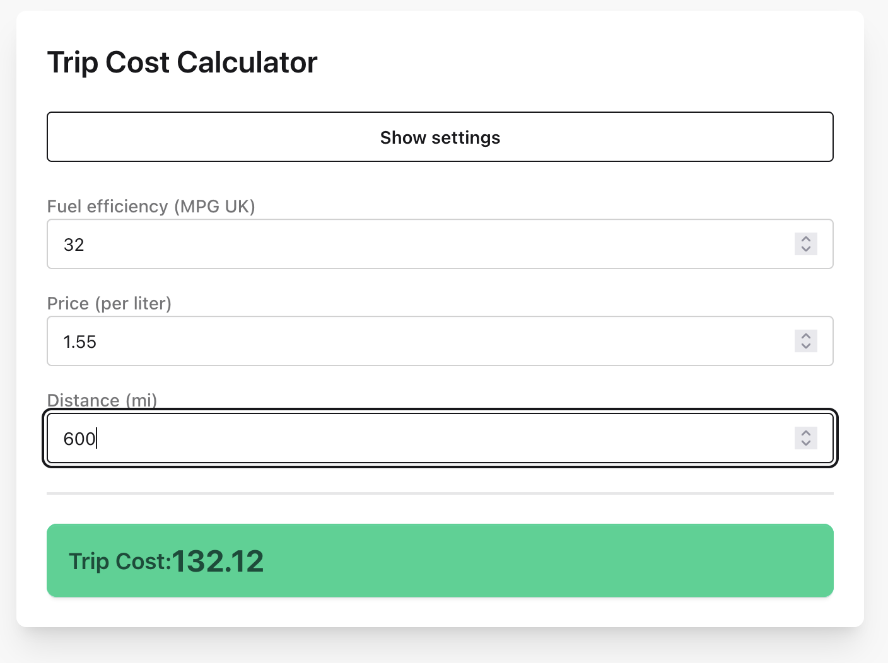

# stcc

Simple trip cost calculator. Supports miles and km, liters and gallons (US/UK).

Hosted at [https://fuel.suddengunter.com/](https://fuel.suddengunter.com/).



## Why?

Mostly to try modern simple frontend with Bun/daisyUI/AlpineJS.

## How to build?

```bash
bun prod
```

## How to run locally?

```bash
bun dev
```